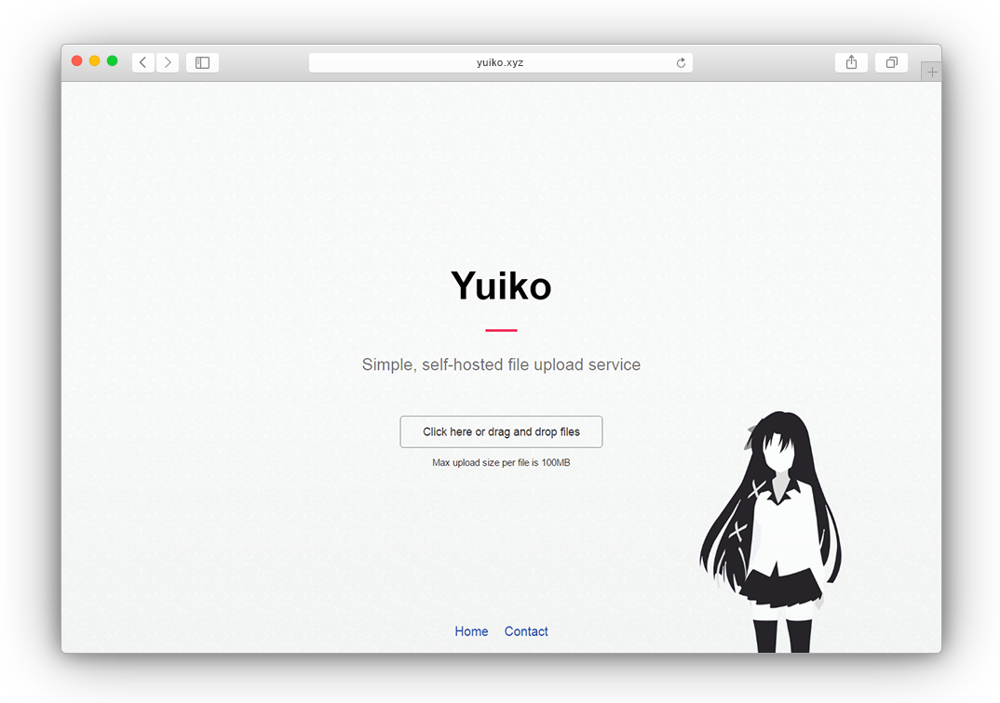

# Yuiko
###### Simple, self-hosted file upload service



## Features
- One click file uploading
- Minimalistic interface
- Drag & Drop
- [Sharex](https://getsharex.com/) support

### Demo
Visit [yko.im](https://yko.im/) for working example

## Install
1. Clone the repository or download the zip
2. Run `npm install` to install dependencies

## Configuration
1. Create `local.toml` in `config`
2. Override defaults in `local.toml` following `default.toml` format

`default.toml` contains comments about the 

## Usage
1. Run `yuiko.js` using `node yuiko` or whatever process manager you like

## File upload

Using the website is straight-forward, as the button says, you can either click on it or drag and drop files on the page. 
Alternatively, you can upload manually by sending `POST` request to `/api/upload` endpoint. 
The files should be included in field named `files[]`, the `Content-Type` should be set to `multipart/form-data`.

The api shall respond with `JSON` with 3 possible elements:
- `success` - `Boolean`, determines whether the request was successful or not
- `error` - `String`, optional, if the request failed, contains error string
- `files` - `Array`, array with uploaded files

The `files` array containes elements of the following structure:
- `name` - `String`, name on the server
- `size` - `Number`, file size
- `url` - `String`, the URL on which the file is accessable

Example response:
```JSON
{
  "success": true,
  "files": [
    {
      "name": "ABC",
      "size": 42,
      "url": "http://yuiko.xyz/files/ABC"
    }
  ]
}
```

## Database
Default database engine is set to `sqlite3`, although it's fairly easy to change it to any of the engines supported by [Knex](tgriesser/knex).
Visit it's page for documentation.

## Reversed Proxy
The application, like the most node web applications, is made to run behind reversed proxy. 
You can utilize `nginx` to create one, the configuration should be similar to:

```$xslt
upstream yuiko {
  server 127.0.0.1:4242;
  keepalive 128;
}

server {
  listen 80;
  server_name yuiko.xyz;

  location / {
    proxy_pass http://yuiko/;
    proxy_redirect off;

    proxy_set_header Host $host;
    proxy_set_header X-Real-IP $remote_addr;
    proxy_set_header X-Forwarded-For $proxy_add_x_forwarded_for;
    proxy_set_header X-NginX-Proxy true;
  }
}
```

Depending on you allowed uploaded file size, you may need to change `client_max_body_size` in the `http` block of the main nginx configuration file.
Example:

```$xslt
http {
  ...
  client_max_body_size 100m;
  ...
}
```

For SSL support and more options consult [Nginx](https://www.nginx.com) documentation.
