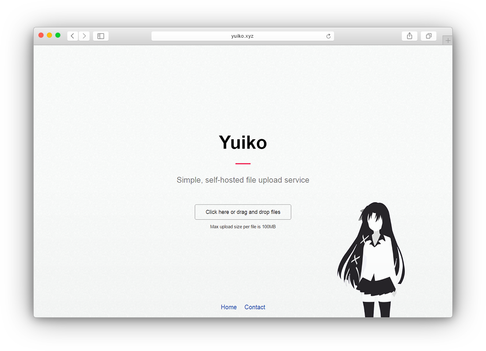

# Yuiko
###### Simple, self-hosted file upload service



## Features
- One click file uploading
- Minimalistic interface
- Drag & Drop
- [Sharex](https://getsharex.com/) support

### Demo
Visit [yko.im](https://yko.im/) for working example

## Install
1. Clone the repository or download the zip
2. Run `npm install` to install dependencies

## Configuration
1. Create `local.toml` in `config`
2. Override defaults in `local.toml` following `default.toml` format

`default.toml` contains comments about the 

## Usage
1. Run `yuiko.js` using `node yuiko` or whatever process manager you like

## File upload
Using the website is straight-forward, as the button says, you can either click on it or drag and drop files on the page. 
Alternatively, you can upload manually by sending `POST` request to `/api/upload` endpoint. 
The files should be included in field named `files[]`, the `Content-Type` should be set to `multipart/form-data`.
The request may contain optional `token` field with user identification token.

The api shall respond with `JSON` with 3 possible elements:
- `success` - `Boolean`, determines whether the request was successful or not
- `error` - `String`, optional, if the request failed, contains error string
- `files` - `Array`, array with uploaded files

The `files` array containes elements of the following structure:
- `name` - `String`, name on the server
- `extension` - `String`, extension of the file
- `size` - `Number`, file size (in bytes)
- `url` - `String`, the URL on which the file is accessible

Example response:
```JSON
{
  "success": true,
  "files": [
    {
      "name": "ABC",
      "extension": ".jpg",
      "size": 42,
      "url": "http://yuiko.xyz/files/ABC.jpg"
    }
  ]
}
```

## File serving
Files are served from `config.files.uploadFolder` under `config.files.accessPath`. 
The base name of the file (the extension is omitted) is looked up in the database in order to get related file from the storage.
One file may be served under many names (aliases). Every user will get different name for the same file, all public uploads gets the same name.

For public uploads, `Content-disposition` hear sets `filename` to `name` (as in url). For private uploads `filename` is set to original name.
That's done to keep public upload more anonymous.

## Users
User accounts are yet to be implemented.

## Database
Default database engine is set to `sqlite3`, although it's fairly easy to change it to any of the engines supported by [Knex](https://github.com/tgriesser/knex).
Visit it's page for documentation.

## Reversed Proxy
The application, like the most node web applications, is made to run behind reversed proxy. 
You can utilize `nginx` to create one, the configuration should be similar to:

```$xslt
upstream yuiko {
  server 127.0.0.1:4242;
  keepalive 128;
}

server {
  listen 80;
  server_name yuiko.xyz;

  location / {
    proxy_pass http://yuiko/;
    proxy_redirect off;

    proxy_set_header Host $host;
    proxy_set_header X-Real-IP $remote_addr;
    proxy_set_header X-Forwarded-For $proxy_add_x_forwarded_for;
    proxy_set_header X-NginX-Proxy true;
  }
}
```

Depending on you allowed uploaded file size, you may need to change `client_max_body_size` in the `http` block of the main nginx configuration file.
Example:

```$xslt
http {
  ...
  client_max_body_size 100m;
  ...
}
```

For SSL support and more options consult [Nginx](https://www.nginx.com) documentation.

## TODOs and developement ideas
- User accounts
  - [ ] Creating accounts
  - [ ] Signing in
  - [ ] Private upload
  - [ ] Rank system
- File management
  - [ ] Associate an upload with an album
  - [ ] Delete uploads
  - [ ] Request new name for a file
- Control Panel
  - [ ] File browser
  - [ ] User management
- Database migration manager
- Config helper
- Container support (Docker?)
- Better error handling
- Make the code cleaner
